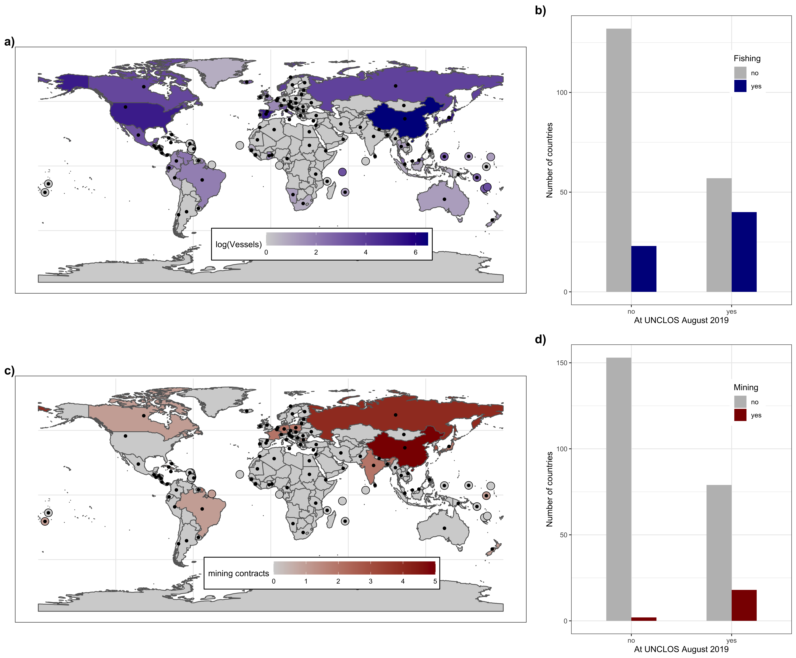

abnj\_countries
================
Millie Chapman
9/4/2020

``` r
library(tidyverse)
```

    ## ── Attaching packages ───────────────────────────────────── tidyverse 1.3.0 ──

    ## ✓ ggplot2 3.3.2     ✓ purrr   0.3.4
    ## ✓ tibble  3.0.1     ✓ dplyr   1.0.0
    ## ✓ tidyr   1.1.0     ✓ stringr 1.4.0
    ## ✓ readr   1.3.1     ✓ forcats 0.5.0

    ## ── Conflicts ──────────────────────────────────────── tidyverse_conflicts() ──
    ## x dplyr::filter() masks stats::filter()
    ## x dplyr::lag()    masks stats::lag()

``` r
library("rnaturalearth")
library("rnaturalearthdata")
library(tidyverse)
library(gridExtra)
```

    ## 
    ## Attaching package: 'gridExtra'

    ## The following object is masked from 'package:dplyr':
    ## 
    ##     combine

``` r
abnj <- read_csv("../data/abnj_countries.csv")
```

    ## Parsed with column specification:
    ## cols(
    ##   Country = col_character(),
    ##   negotiations = col_double()
    ## )

``` r
iso <- read_csv("../data/iso3.csv")
```

    ## Parsed with column specification:
    ## cols(
    ##   Country = col_character(),
    ##   ISO_3 = col_character()
    ## )

``` r
sala_old <- read_csv("../data/Sala2018table.csv") %>%
  remove_missing()
```

    ## Parsed with column specification:
    ## cols(
    ##   Country = col_character(),
    ##   Vessels = col_double(),
    ##   Fishing_Days = col_double(),
    ##   Fishing_kWh = col_double()
    ## )

    ## Warning: Removed 54 rows containing missing values.

``` r
corporate_flags <- read_csv("../data/HS_fishing_vessels_with_corp_actors.csv") %>% #mutate(main_company_flag == flag) %>%
  group_by(main_company_flag) %>% count() %>%
  remove_missing() %>%
  mutate(ISO_3 = main_company_flag)
```

    ## Warning: Missing column names filled in: 'X17' [17]

    ## Parsed with column specification:
    ## cols(
    ##   .default = col_character(),
    ##   ssvid = col_double(),
    ##   imo = col_double(),
    ##   length_m = col_double(),
    ##   tonnage_gt = col_double(),
    ##   engine_power = col_double(),
    ##   hours = col_double(),
    ##   fishing_hours = col_double(),
    ##   hours_HS = col_double(),
    ##   fishing_hours_HS = col_double(),
    ##   X17 = col_logical()
    ## )

    ## See spec(...) for full column specifications.

    ## Warning: Removed 1 rows containing missing values.

``` r
abnj <- abnj %>%
  full_join(iso, by = "Country") %>%
  full_join(corporate_flags, by = "ISO_3") %>%
  rename(iso_a3 = "ISO_3") %>%
  mutate(Vessels = n) %>%
  mutate(Fishing_Days = replace_na(n, 0),
         negotiations = replace_na(negotiations, 0)) %>%
  mutate(negotiations = ifelse(negotiations == 0, "no", "yes"),
         fishing = ifelse(Fishing_Days == 0, "no", "yes")) 
  #mutate(fishing = ifelse(Fishing_Days>0,1,0)) %>%
```

``` r
mining <- read_csv("../data/mining_countries.csv") %>%
  rename(iso_a3 = "ISO_3",
         mining = "X3") %>%
  group_by(iso_a3) %>%
  summarize(mining = sum(mining))
```

    ## Warning: Missing column names filled in: 'X3' [3]

    ## Parsed with column specification:
    ## cols(
    ##   Country = col_character(),
    ##   ISO_3 = col_character(),
    ##   X3 = col_double()
    ## )

    ## `summarise()` ungrouping output (override with `.groups` argument)

``` r
abnj <- abnj %>%
  left_join(mining) %>%
  mutate(mining = replace_na(mining, 0))
```

    ## Joining, by = "iso_a3"

``` r
world <- ne_countries(scale = "medium", returnclass = "sf") %>%
  left_join(abnj, by = "iso_a3")
```

``` r
library(sf)
```

    ## Linking to GEOS 3.7.2, GDAL 2.4.2, PROJ 5.2.0

``` r
world_points<- st_centroid(world)
```

    ## Warning in st_centroid.sf(world): st_centroid assumes attributes are constant
    ## over geometries of x

    ## Warning in st_centroid.sfc(st_geometry(x), of_largest_polygon =
    ## of_largest_polygon): st_centroid does not give correct centroids for longitude/
    ## latitude data

``` r
world_points <- cbind(world, st_coordinates(st_centroid(world$geometry)))
```

    ## Warning in st_centroid.sfc(world$geometry): st_centroid does not give correct
    ## centroids for longitude/latitude data

``` r
smisna <- data.frame(adm0_a3=c("ATG", "COM", "CPV", "DMA", "FJI", "FSM",
     "GRD", "KIR", "KNA", "LCA", "MDV", "MHL", "MUS", "NRU","PLW", "SLB", 
     "STP", "SYC", "TON", "TUV", "VCT", "VUT", "WSM"), 
     smisna = "yes")
```

``` r
world_points <- world_points %>%
  left_join(smisna) 
```

    ## Joining, by = "adm0_a3"

``` r
smisna_points <- world_points %>%
  mutate(smisna = replace_na(smisna, "no")) %>%
  filter(smisna == "yes")


world_points <- world_points %>%
  filter(negotiations == "yes")
```

``` r
abnj_map_fishing <- ggplot(data = world) +
  geom_sf(aes(fill = log(Vessels)), color = "#666666") +
  geom_point(data = smisna_points, aes(x=X, y=Y, size = 7, fill = log(Vessels)),  pch=21, show.legend = FALSE)+
  scale_fill_gradient(low = "lightgrey",
                       high = "darkblue",space = "Lab",
                       na.value = "lightgrey", guide = "colourbar", aesthetics = "fill") +
  geom_point(data = world_points, aes(x=X, y=Y), colour = "black") + theme_minimal() +
  #scale_fill_manual(values = c("no" = "black", "yes" = "grey")) 
  theme(legend.direction = "horizontal",
        legend.position = c(0.6, 0.2),
        #legend.title = element_blank(),
        panel.border = element_rect(colour = "black", fill=NA),
        legend.background = element_rect(fill = "white", colour = "black")) +
  theme(legend.key.width = unit(1.5, "cm")) +
  theme(axis.title.x=element_blank(),
        axis.title.y=element_blank())
abnj_map_fishing
```

<!-- -->

``` r
world %>% rename(`mining contracts` = mining)
```

    ## Simple feature collection with 241 features and 71 fields
    ## geometry type:  MULTIPOLYGON
    ## dimension:      XY
    ## bbox:           xmin: -180 ymin: -89.99893 xmax: 180 ymax: 83.59961
    ## CRS:            +proj=longlat +datum=WGS84 +no_defs +ellps=WGS84 +towgs84=0,0,0
    ## First 10 features:
    ##    scalerank      featurecla labelrank           sovereignt sov_a3 adm0_dif
    ## 1          3 Admin-0 country         5          Netherlands    NL1        1
    ## 2          1 Admin-0 country         3          Afghanistan    AFG        0
    ## 3          1 Admin-0 country         3               Angola    AGO        0
    ## 4          1 Admin-0 country         6       United Kingdom    GB1        1
    ## 5          1 Admin-0 country         6              Albania    ALB        0
    ## 6          3 Admin-0 country         6              Finland    FI1        1
    ## 7          3 Admin-0 country         6              Andorra    AND        0
    ## 8          1 Admin-0 country         4 United Arab Emirates    ARE        0
    ## 9          1 Admin-0 country         2            Argentina    ARG        0
    ## 10         1 Admin-0 country         6              Armenia    ARM        0
    ##    level              type                admin adm0_a3 geou_dif
    ## 1      2           Country                Aruba     ABW        0
    ## 2      2 Sovereign country          Afghanistan     AFG        0
    ## 3      2 Sovereign country               Angola     AGO        0
    ## 4      2        Dependency             Anguilla     AIA        0
    ## 5      2 Sovereign country              Albania     ALB        0
    ## 6      2           Country                Aland     ALD        0
    ## 7      2 Sovereign country              Andorra     AND        0
    ## 8      2 Sovereign country United Arab Emirates     ARE        0
    ## 9      2 Sovereign country            Argentina     ARG        0
    ## 10     2 Sovereign country              Armenia     ARM        0
    ##                 geounit gu_a3 su_dif              subunit su_a3 brk_diff
    ## 1                 Aruba   ABW      0                Aruba   ABW        0
    ## 2           Afghanistan   AFG      0          Afghanistan   AFG        0
    ## 3                Angola   AGO      0               Angola   AGO        0
    ## 4              Anguilla   AIA      0             Anguilla   AIA        0
    ## 5               Albania   ALB      0              Albania   ALB        0
    ## 6                 Aland   ALD      0                Aland   ALD        0
    ## 7               Andorra   AND      0              Andorra   AND        0
    ## 8  United Arab Emirates   ARE      0 United Arab Emirates   ARE        0
    ## 9             Argentina   ARG      0            Argentina   ARG        0
    ## 10              Armenia   ARM      0              Armenia   ARM        0
    ##                    name            name_long brk_a3             brk_name
    ## 1                 Aruba                Aruba    ABW                Aruba
    ## 2           Afghanistan          Afghanistan    AFG          Afghanistan
    ## 3                Angola               Angola    AGO               Angola
    ## 4              Anguilla             Anguilla    AIA             Anguilla
    ## 5               Albania              Albania    ALB              Albania
    ## 6                 Aland        Aland Islands    ALD                Aland
    ## 7               Andorra              Andorra    AND              Andorra
    ## 8  United Arab Emirates United Arab Emirates    ARE United Arab Emirates
    ## 9             Argentina            Argentina    ARG            Argentina
    ## 10              Armenia              Armenia    ARM              Armenia
    ##    brk_group abbrev postal                    formal_en formal_fr note_adm0
    ## 1       <NA>  Aruba     AW                        Aruba      <NA>     Neth.
    ## 2       <NA>   Afg.     AF Islamic State of Afghanistan      <NA>      <NA>
    ## 3       <NA>   Ang.     AO  People's Republic of Angola      <NA>      <NA>
    ## 4       <NA>   Ang.     AI                         <NA>      <NA>      U.K.
    ## 5       <NA>   Alb.     AL          Republic of Albania      <NA>      <NA>
    ## 6       <NA>  Aland     AI                Åland Islands      <NA>      Fin.
    ## 7       <NA>   And.    AND      Principality of Andorra      <NA>      <NA>
    ## 8       <NA> U.A.E.     AE         United Arab Emirates      <NA>      <NA>
    ## 9       <NA>   Arg.     AR           Argentine Republic      <NA>      <NA>
    ## 10      <NA>   Arm.    ARM          Republic of Armenia      <NA>      <NA>
    ##    note_brk            name_sort name_alt mapcolor7 mapcolor8 mapcolor9
    ## 1      <NA>                Aruba     <NA>         4         2         2
    ## 2      <NA>          Afghanistan     <NA>         5         6         8
    ## 3      <NA>               Angola     <NA>         3         2         6
    ## 4      <NA>             Anguilla     <NA>         6         6         6
    ## 5      <NA>              Albania     <NA>         1         4         1
    ## 6      <NA>                Aland     <NA>         4         1         4
    ## 7      <NA>              Andorra     <NA>         1         4         1
    ## 8      <NA> United Arab Emirates     <NA>         2         1         3
    ## 9      <NA>            Argentina     <NA>         3         1         3
    ## 10     <NA>              Armenia     <NA>         3         1         2
    ##    mapcolor13  pop_est gdp_md_est pop_year lastcensus gdp_year
    ## 1           9   103065     2258.0       NA       2010       NA
    ## 2           7 28400000    22270.0       NA       1979       NA
    ## 3           1 12799293   110300.0       NA       1970       NA
    ## 4           3    14436      108.9       NA         NA       NA
    ## 5           6  3639453    21810.0       NA       2001       NA
    ## 6           6    27153     1563.0       NA         NA       NA
    ## 7           8    83888     3660.0       NA       1989       NA
    ## 8           3  4798491   184300.0       NA       2010       NA
    ## 9          13 40913584   573900.0       NA       2010       NA
    ## 10         10  2967004    18770.0       NA       2001       NA
    ##                       economy              income_grp wikipedia fips_10 iso_a2
    ## 1        6. Developing region 2. High income: nonOECD        NA    <NA>     AW
    ## 2   7. Least developed region           5. Low income        NA    <NA>     AF
    ## 3   7. Least developed region  3. Upper middle income        NA    <NA>     AO
    ## 4        6. Developing region  3. Upper middle income        NA    <NA>     AI
    ## 5        6. Developing region  4. Lower middle income        NA    <NA>     AL
    ## 6  2. Developed region: nonG7    1. High income: OECD        NA    <NA>     AX
    ## 7  2. Developed region: nonG7 2. High income: nonOECD        NA    <NA>     AD
    ## 8        6. Developing region 2. High income: nonOECD        NA    <NA>     AE
    ## 9     5. Emerging region: G20  3. Upper middle income        NA    <NA>     AR
    ## 10       6. Developing region  4. Lower middle income        NA    <NA>     AM
    ##    iso_a3 iso_n3 un_a3 wb_a2 wb_a3 woe_id adm0_a3_is adm0_a3_us adm0_a3_un
    ## 1     ABW    533   533    AW   ABW     NA        ABW        ABW         NA
    ## 2     AFG    004   004    AF   AFG     NA        AFG        AFG         NA
    ## 3     AGO    024   024    AO   AGO     NA        AGO        AGO         NA
    ## 4     AIA    660   660  <NA>  <NA>     NA        AIA        AIA         NA
    ## 5     ALB    008   008    AL   ALB     NA        ALB        ALB         NA
    ## 6     ALA    248   248  <NA>  <NA>     NA        ALA        ALD         NA
    ## 7     AND    020   020    AD   ADO     NA        AND        AND         NA
    ## 8     ARE    784   784    AE   ARE     NA        ARE        ARE         NA
    ## 9     ARG    032   032    AR   ARG     NA        ARG        ARG         NA
    ## 10    ARM    051   051    AM   ARM     NA        ARM        ARM         NA
    ##    adm0_a3_wb     continent region_un       subregion
    ## 1          NA North America  Americas       Caribbean
    ## 2          NA          Asia      Asia   Southern Asia
    ## 3          NA        Africa    Africa   Middle Africa
    ## 4          NA North America  Americas       Caribbean
    ## 5          NA        Europe    Europe Southern Europe
    ## 6          NA        Europe    Europe Northern Europe
    ## 7          NA        Europe    Europe Southern Europe
    ## 8          NA          Asia      Asia    Western Asia
    ## 9          NA South America  Americas   South America
    ## 10         NA          Asia      Asia    Western Asia
    ##                     region_wb name_len long_len abbrev_len tiny homepart
    ## 1   Latin America & Caribbean        5        5          5    4       NA
    ## 2                  South Asia       11       11          4   NA        1
    ## 3          Sub-Saharan Africa        6        6          4   NA        1
    ## 4   Latin America & Caribbean        8        8          4   NA       NA
    ## 5       Europe & Central Asia        7        7          4   NA        1
    ## 6       Europe & Central Asia        5       13          5    5       NA
    ## 7       Europe & Central Asia        7        7          4    5        1
    ## 8  Middle East & North Africa       20       20          6   NA        1
    ## 9   Latin America & Caribbean        9        9          4   NA        1
    ## 10      Europe & Central Asia        7        7          4   NA        1
    ##                 Country negotiations main_company_flag  n Vessels Fishing_Days
    ## 1                 Aruba           no              <NA> NA      NA            0
    ## 2           Afghanistan           no              <NA> NA      NA            0
    ## 3                Angola           no              <NA> NA      NA            0
    ## 4              Anguilla           no              <NA> NA      NA            0
    ## 5               Albania           no              <NA> NA      NA            0
    ## 6      \x81land Islands           no              <NA> NA      NA            0
    ## 7               Andorra           no              <NA> NA      NA            0
    ## 8  United Arab Emirates           no              <NA> NA      NA            0
    ## 9             Argentina          yes              <NA> NA      NA            0
    ## 10              Armenia           no              <NA> NA      NA            0
    ##    fishing mining contracts                       geometry
    ## 1       no                0 MULTIPOLYGON (((-69.89912 1...
    ## 2       no                0 MULTIPOLYGON (((74.89131 37...
    ## 3       no                0 MULTIPOLYGON (((14.19082 -5...
    ## 4       no                0 MULTIPOLYGON (((-63.00122 1...
    ## 5       no                0 MULTIPOLYGON (((20.06396 42...
    ## 6       no                0 MULTIPOLYGON (((20.61133 60...
    ## 7       no                0 MULTIPOLYGON (((1.706055 42...
    ## 8       no                0 MULTIPOLYGON (((53.92783 24...
    ## 9       no                0 MULTIPOLYGON (((-64.54917 -...
    ## 10      no                0 MULTIPOLYGON (((45.55234 40...

``` r
abnj_map_mining <- world %>% 
  rename(`mining contracts` = mining) %>%
  ggplot() +
  geom_sf(aes(fill = `mining contracts`), color = "#666666") +
  geom_point(data = smisna_points, aes(x=X, y=Y, size = 7, fill = mining),  pch=21, show.legend = FALSE)+
  scale_fill_gradient(low = "lightgrey",
                       high = "darkred",space = "Lab",
                       na.value = "lightgrey", guide = "colourbar", aesthetics = "fill") +
  geom_point(data = world_points, aes(x=X, y=Y), colour = "black") + theme_minimal() +
  #scale_fill_manual(values = c("no" = "black", "yes" = "grey")) +
  theme(legend.direction = "horizontal",
        legend.position = c(0.6, 0.2),
        #legend.title = element_blank(),
        panel.border = element_rect(colour = "black", fill=NA),
        legend.background = element_rect(fill = "white", colour = "black")) +
  theme(legend.key.width = unit(1.5, "cm")) +
  theme(axis.title.x=element_blank(),
        axis.title.y=element_blank())
abnj_map_mining
```

<!-- -->

barchart of

``` r
abnj_n <- abnj %>% select(negotiations, fishing) %>%  
  group_by(negotiations, fishing) %>%
  count()
```

``` r
abnj_bar_fish <- ggplot(abnj_n, aes(x = negotiations, y = n, fill = fishing)) + geom_bar(stat = "identity", position = "dodge", width = 0.5) +theme_bw() +
  scale_fill_manual("Fishing", values = c("no" = "grey", "yes" = "darkblue"))+ 
  theme(legend.position = c(0.8, 0.8)) +
  xlab("At UNCLOS August 2019") + ylab("Number of countries")
abnj_bar_fish
```

<!-- -->

barchart of

``` r
abnj_m <- abnj %>%
  mutate(mining = ifelse(mining >0,"yes","no")) %>%
  mutate(mining = replace_na(mining, "no")) %>%
  select(negotiations, mining) %>%  
  group_by(negotiations, mining) %>%
  count()
```

``` r
abnj_bar_mining <- ggplot(abnj_m, aes(x = negotiations, y = n, fill = mining)) + geom_bar(stat = "identity", position = "dodge", width = 0.5) +theme_bw() +
  scale_fill_manual("Mining", values = c("no" = "grey", "yes" = "darkred"))+ 
  theme(legend.position = c(0.8, 0.8)) +
  xlab("At UNCLOS August 2019") + ylab("Number of countries")
abnj_bar_mining
```

<!-- -->

``` r
abnj_map_fishing <- abnj_map_fishing + labs(tag = element_text("a)")) +
      theme(plot.tag = element_text(face="bold", size = 16))

abnj_bar_fish<- abnj_bar_fish + labs(tag = element_text("b)")) +
      theme(plot.tag = element_text(face="bold", size = 16))

abnj_map_mining <- abnj_map_mining + labs(tag = element_text("c)")) +
      theme(plot.tag = element_text(face="bold", size = 16))

abnj_bar_mining <- abnj_bar_mining + labs(tag = element_text("d)")) +
      theme(plot.tag = element_text(face="bold", size = 16))
```

``` r
library(gridExtra)


grid.arrange(abnj_map_fishing,  abnj_bar_fish, abnj_map_mining, abnj_bar_mining, ncol = 6, 
             layout_matrix = rbind(c(1,1,1,1,2,2), c(3,3,3,3,4,4)))
```

<!-- -->
