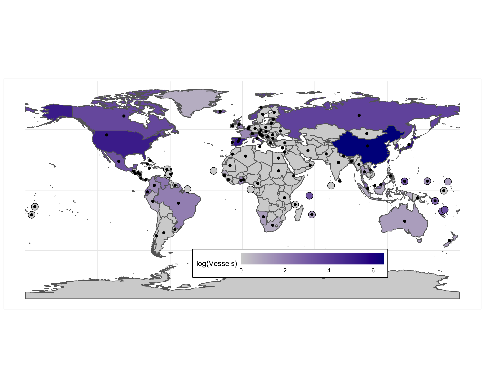
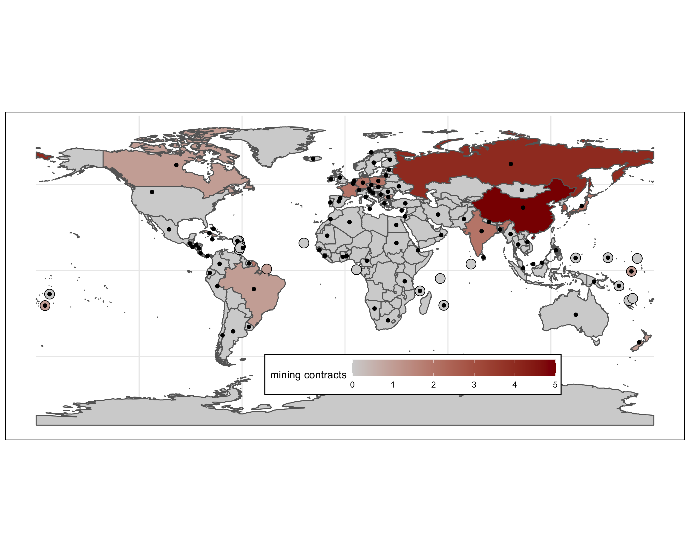
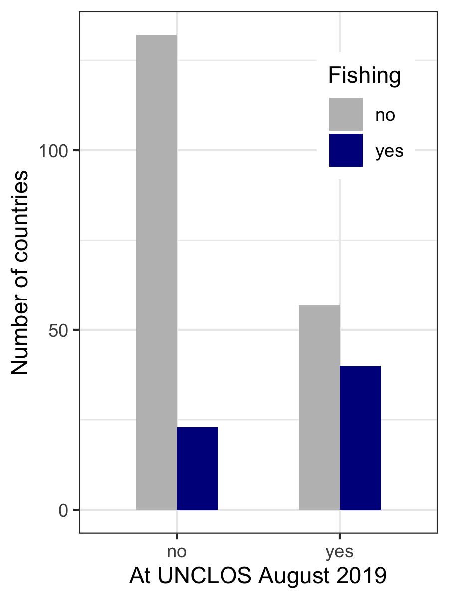
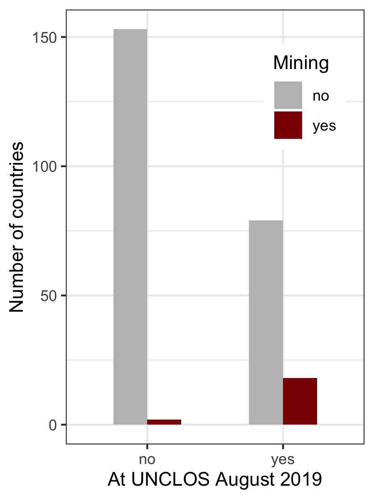

abnj\_countries
================
Millie Chapman
9/4/2020

``` r
library(tidyverse)
```

    ## ── Attaching packages ─────────────────────────────────────────────────────────────────────── tidyverse 1.3.0 ──

    ## ✓ ggplot2 3.3.2     ✓ purrr   0.3.4
    ## ✓ tibble  3.0.1     ✓ dplyr   1.0.0
    ## ✓ tidyr   1.1.0     ✓ stringr 1.4.0
    ## ✓ readr   1.3.1     ✓ forcats 0.5.0

    ## ── Conflicts ────────────────────────────────────────────────────────────────────────── tidyverse_conflicts() ──
    ## x dplyr::filter() masks stats::filter()
    ## x dplyr::lag()    masks stats::lag()

``` r
library("rnaturalearth")
library("rnaturalearthdata")
library(tidyverse)
library(gridExtra)
```

    ## 
    ## Attaching package: 'gridExtra'

    ## The following object is masked from 'package:dplyr':
    ## 
    ##     combine

``` r
abnj <- read_csv("../data/abnj_countries.csv")
```

    ## Parsed with column specification:
    ## cols(
    ##   Country = col_character(),
    ##   negotiations = col_double()
    ## )

``` r
iso <- read_csv("../data/iso3.csv")
```

    ## Parsed with column specification:
    ## cols(
    ##   Country = col_character(),
    ##   ISO_3 = col_character()
    ## )

``` r
sala <- read_csv("../data/Sala2018table.csv") %>%
  remove_missing()
```

    ## Parsed with column specification:
    ## cols(
    ##   Country = col_character(),
    ##   Vessels = col_double(),
    ##   Fishing_Days = col_double(),
    ##   Fishing_kWh = col_double()
    ## )

    ## Warning: Removed 54 rows containing missing values.

``` r
abnj <- abnj %>%
  full_join(sala, by = "Country") %>%
  full_join(iso, by = "Country") %>%
  rename(iso_a3 = "ISO_3") %>%
  mutate(Fishing_Days = replace_na(Fishing_Days, 0),
         negotiations = replace_na(negotiations, 0)) %>%
  mutate(negotiations = ifelse(negotiations == 0, "no", "yes"),
         fishing = ifelse(Fishing_Days == 0, "no", "yes")) 
  #mutate(fishing = ifelse(Fishing_Days>0,1,0)) %>%
```

``` r
mining <- read_csv("../data/mining_countries.csv") %>%
  rename(iso_a3 = "ISO_3",
         mining = "X3") %>%
  group_by(iso_a3) %>%
  summarize(mining = sum(mining))
```

    ## Warning: Missing column names filled in: 'X3' [3]

    ## Parsed with column specification:
    ## cols(
    ##   Country = col_character(),
    ##   ISO_3 = col_character(),
    ##   X3 = col_double()
    ## )

    ## `summarise()` ungrouping output (override with `.groups` argument)

``` r
abnj <- abnj %>%
  left_join(mining) %>%
  mutate(mining = replace_na(mining, 0))
```

    ## Joining, by = "iso_a3"

``` r
world <- ne_countries(scale = "medium", returnclass = "sf") %>%
  left_join(abnj, by = "iso_a3")
```

``` r
library(sf)
```

    ## Linking to GEOS 3.7.2, GDAL 2.4.2, PROJ 5.2.0

``` r
world_points<- st_centroid(world)
```

    ## Warning in st_centroid.sf(world): st_centroid assumes attributes are constant
    ## over geometries of x

    ## Warning in st_centroid.sfc(st_geometry(x), of_largest_polygon =
    ## of_largest_polygon): st_centroid does not give correct centroids for longitude/
    ## latitude data

``` r
world_points <- cbind(world, st_coordinates(st_centroid(world$geometry)))
```

    ## Warning in st_centroid.sfc(world$geometry): st_centroid does not give correct
    ## centroids for longitude/latitude data

``` r
smisna <- data.frame(adm0_a3=c("ATG", "COM", "CPV", "DMA", "FJI", "FSM",
     "GRD", "KIR", "KNA", "LCA", "MDV", "MHL", "MUS", "NRU","PLW", "SLB", 
     "STP", "SYC", "TON", "TUV", "VCT", "VUT", "WSM"), 
     smisna = "yes")
```

``` r
world_points <- world_points %>%
  left_join(smisna) 
```

    ## Joining, by = "adm0_a3"

``` r
smisna_points <- world_points %>%
  mutate(smisna = replace_na(smisna, "no")) %>%
  filter(smisna == "yes")


world_points <- world_points %>%
  filter(negotiations == "yes")
```

``` r
abnj_map <- ggplot(data = world) +
  geom_sf(aes(fill = log(Vessels)), color = "#666666") +
  geom_point(data = smisna_points, aes(x=X, y=Y, size = 7, fill = log(Vessels)),  pch=21, show.legend = FALSE)+
  scale_fill_gradient(low = "lightgrey",
                       high = "darkblue",space = "Lab",
                       na.value = "lightgrey", guide = "colourbar", aesthetics = "fill") +
  geom_point(data = world_points, aes(x=X, y=Y), colour = "black") + theme_minimal() +
  #scale_fill_manual(values = c("no" = "black", "yes" = "grey")) 
  theme(legend.direction = "horizontal",
        legend.position = c(0.6, 0.2),
        #legend.title = element_blank(),
        panel.border = element_rect(colour = "black", fill=NA),
        legend.background = element_rect(fill = "white", colour = "black")) +
  theme(legend.key.width = unit(1.5, "cm")) +
  theme(axis.title.x=element_blank(),
        axis.title.y=element_blank())
abnj_map
```

<!-- -->

``` r
abnj_map <- ggplot(data = world) +
  geom_sf(aes(fill = mining), color = "#666666") +
  geom_point(data = smisna_points, aes(x=X, y=Y, size = 7, fill = mining),  pch=21, show.legend = FALSE)+
  scale_fill_gradient(low = "lightgrey",
                       high = "darkred",space = "Lab",
                       na.value = "lightgrey", guide = "colourbar", aesthetics = "fill") +
  geom_point(data = world_points, aes(x=X, y=Y), colour = "black") + theme_minimal() +
  #scale_fill_manual(values = c("no" = "black", "yes" = "grey")) +
  theme(legend.direction = "horizontal",
        legend.position = c(0.6, 0.2),
        #legend.title = element_blank(),
        panel.border = element_rect(colour = "black", fill=NA),
        legend.background = element_rect(fill = "white", colour = "black")) +
  theme(legend.key.width = unit(1.5, "cm")) +
  theme(axis.title.x=element_blank(),
        axis.title.y=element_blank())
abnj_map
```

<!-- -->

barchart of

``` r
abnj_n <- abnj %>%
  group_by(negotiations, fishing) %>%
  count()
```

``` r
abnj_bar1 <- ggplot(abnj_n, aes(x = negotiations, y = n, fill = fishing)) + geom_bar(stat = "identity", position = "dodge", width = 0.5) +theme_bw() +
  scale_fill_manual("Fishing", values = c("no" = "grey", "yes" = "darkblue"))+ 
  theme(legend.position = c(0.8, 0.8)) +
  xlab("At UNCLOS August 2019") + ylab("Number of countries")
abnj_bar1
```

<!-- -->

barchart of

``` r
abnj_m <- abnj %>%
  mutate(mining = ifelse(mining >0,"yes","no")) %>%
  mutate(mining = replace_na(mining, "no")) %>%
  group_by(negotiations, mining) %>%
  count()
```

``` r
abnj_bar1 <- ggplot(abnj_m, aes(x = negotiations, y = n, fill = mining)) + geom_bar(stat = "identity", position = "dodge", width = 0.5) +theme_bw() +
  scale_fill_manual("Mining", values = c("no" = "grey", "yes" = "darkred"))+ 
  theme(legend.position = c(0.8, 0.8)) +
  xlab("At UNCLOS August 2019") + ylab("Number of countries")
abnj_bar1
```

<!-- -->
